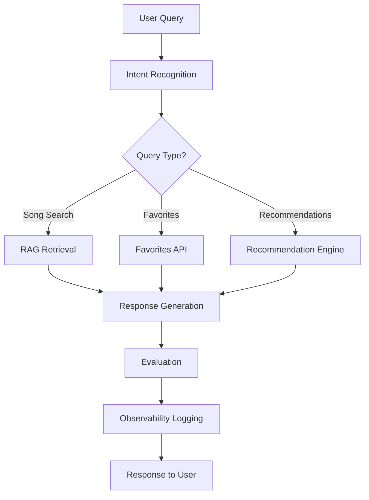
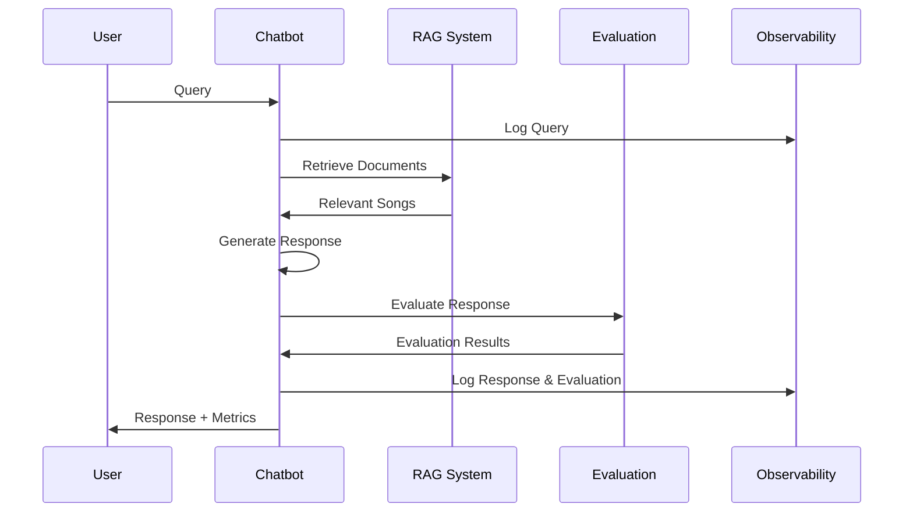
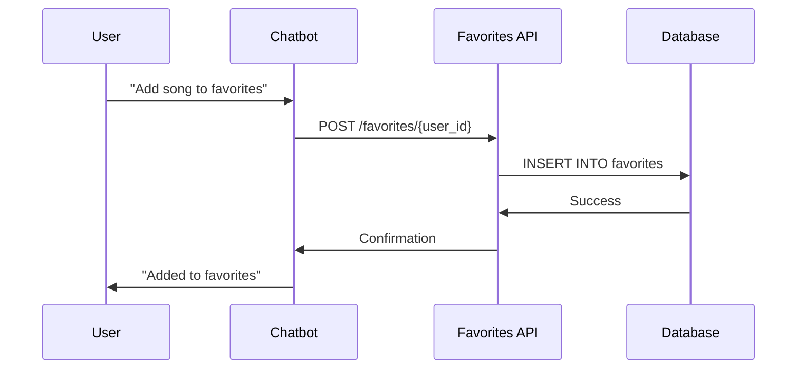
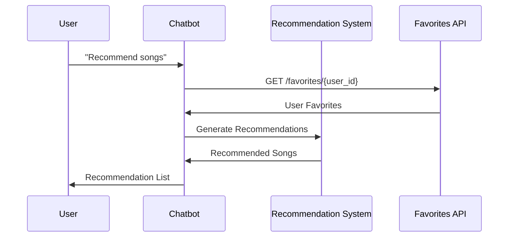

# 🎵 RAG Chatbot System - Technical Documentation

## 📋 Table of Contents
1. [System Overview](#system-overview)
2. [Architecture](#architecture)
3. [Technologies Used](#technologies-used)
4. [How It Works](#how-it-works)
5. [Component Details](#component-details)
6. [Data Flow](#data-flow)
7. [Evaluation Framework](#evaluation-framework)
8. [Observability & Tracing](#observability--tracing)
9. [API Documentation](#api-documentation)
10. [Performance Considerations](#performance-considerations)
11. [Deployment Guide](#deployment-guide)

## 🎯 System Overview

The RAG (Retrieval-Augmented Generation) Chatbot System is a comprehensive solution that answers user queries about songs using a curated dataset. The system prevents hallucinations by restricting responses to dataset facts and provides advanced features including evaluation, observability, and recommendations.

### Key Features
- **RAG Pipeline**: Vector embeddings and semantic search
- **Hallucination Prevention**: Dataset-only responses with citations
- **Evaluation System**: Comprehensive response quality assessment
- **Observability**: End-to-end tracing with Langfuse
- **Favorites Management**: User-specific song storage
- **Recommendation Engine**: Mood-based and preference-based suggestions

## 🏗️ Architecture

```
┌─────────────────────────────────────────────────────────────────┐
│                        User Interface Layer                     │
├─────────────────────────────────────────────────────────────────┤
│  Streamlit Web UI  │  FastAPI REST API  │  Command Line Demo   │
└─────────────────────────────────────────────────────────────────┘
                                │
┌─────────────────────────────────────────────────────────────────┐
│                      Application Layer                          │
├─────────────────────────────────────────────────────────────────┤
│  Main Chatbot  │  Intent Parser  │  Response Generator  │  UI   │
└─────────────────────────────────────────────────────────────────┘
                                │
┌─────────────────────────────────────────────────────────────────┐
│                      Core Services Layer                        │
├─────────────────────────────────────────────────────────────────┤
│  RAG System  │  Evaluation  │  Observability  │  Recommendations │
└─────────────────────────────────────────────────────────────────┘
                                │
┌─────────────────────────────────────────────────────────────────┐
│                      Data & Storage Layer                       │
├─────────────────────────────────────────────────────────────────┤
│  Vector DB  │  SQLite DB  │  CSV Dataset  │  Langfuse Cloud   │
└─────────────────────────────────────────────────────────────────┘
```

## 🛠️ Technologies Used

### Core Framework & Libraries
- **Python 3.13**: Primary programming language
- **FastAPI 0.119.0**: REST API framework for favorites management
- **Streamlit 1.50.0**: Web interface for user interaction
- **Uvicorn 0.38.0**: ASGI server for FastAPI

### Machine Learning & NLP
- **Sentence Transformers 5.1.1**: Vector embeddings and semantic search
- **scikit-learn 1.7.2**: Machine learning utilities and similarity calculations
- **NumPy 2.3.4**: Numerical computations
- **Pandas 2.3.3**: Data manipulation and analysis
- **PyTorch 2.9.0**: Deep learning framework (dependency of sentence-transformers)

### LangChain Ecosystem
- **LangChain 1.0.0**: LLM framework and utilities
- **LangChain Community 0.4**: Community integrations
- **LangChain Core 1.0.0**: Core LangChain functionality

### Observability & Monitoring
- **Langfuse 3.7.0**: LLM observability and tracing platform
- **OpenTelemetry**: Distributed tracing and metrics
- **Custom Logging**: Local trace storage and analytics

### Data Storage
- **SQLite**: Lightweight database for favorites management
- **CSV**: Song dataset storage
- **JSON**: Trace export and configuration

### Visualization & UI
- **Plotly 6.3.1**: Interactive charts and visualizations
- **Altair 5.5.0**: Statistical visualizations
- **Streamlit Components**: Custom UI elements

### Additional Dependencies
- **Pydantic 2.12.3**: Data validation and serialization
- **python-dotenv 1.1.1**: Environment variable management
- **python-multipart 0.0.20**: File upload handling
- **httpx 0.28.1**: HTTP client for API calls

## 🔄 How It Works

### 1. Query Processing Pipeline



### 2. RAG (Retrieval-Augmented Generation) Process

#### Step 1: Document Preparation
- **Dataset Loading**: 30 songs loaded from CSV
- **Text Representation**: Each song converted to searchable text
- **Format**: "Song: [Title] by [Author] - Genre: [Genre] - Mood: [Mood] - Year: [Year]"

#### Step 2: Vector Embeddings
- **Model**: `all-MiniLM-L6-v2` (Sentence Transformers)
- **Process**: Convert song texts to 384-dimensional vectors
- **Storage**: In-memory numpy arrays for fast retrieval

#### Step 3: Query Processing
- **Intent Recognition**: Parse user query to understand intent
- **Query Embedding**: Convert user query to vector
- **Similarity Search**: Calculate cosine similarity with all song vectors
- **Top-K Retrieval**: Return most relevant songs

#### Step 4: Response Generation
- **Context Assembly**: Combine retrieved songs with query context
- **Response Formatting**: Generate natural language response
- **Citation Addition**: Include source information
- **Hallucination Prevention**: Only use information from retrieved documents

### 3. Evaluation Framework

#### Tone Analysis
```python
def _evaluate_tone(self, response: str) -> str:
    # Analyze response for emotional indicators
    friendly_indicators = ['great', 'wonderful', 'amazing']
    apologetic_indicators = ['sorry', 'unfortunately', 'i don\'t have']
    
    # Return: 'friendly', 'apologetic', or 'neutral'
```

#### Factuality Scoring
```python
def _evaluate_factuality(self, response: str, retrieved_docs: List[Dict]) -> float:
    # Check if response contains facts from retrieved documents
    # Score: 0.0 (no facts) to 1.0 (all facts verified)
```

#### Hallucination Detection
```python
def _detect_hallucination(self, response: str, retrieved_docs: List[Dict]) -> bool:
    # Look for uncertainty indicators
    # Check for information not in retrieved documents
    # Return: True if hallucination detected
```

#### RAG Metrics
```python
def _evaluate_rag_metrics(self, query: str, retrieved_docs: List[Dict], response: str) -> Tuple[float, float]:
    # Calculate precision: relevant docs / total docs retrieved
    # Calculate recall: relevant docs / total relevant docs
    # Return: (precision, recall)
```

## 🔧 Component Details

### 1. RAG System (`rag_system.py`)

**Purpose**: Core retrieval and search functionality

**Key Methods**:
- `load_dataset()`: Load and preprocess song data
- `setup_embeddings()`: Create vector embeddings
- `retrieve_relevant_songs()`: Semantic search with cosine similarity
- `search_song_by_title()`: Exact title matching
- `search_songs_by_author()`: Author-based search
- `search_songs_by_genre()`: Genre-based search
- `search_songs_by_mood()`: Mood-based search

**Technical Implementation**:
```python
class RAGSystem:
    def __init__(self, dataset_path: str):
        self.model = SentenceTransformer('all-MiniLM-L6-v2')
        self.embeddings = self.model.encode(song_texts)
    
    def retrieve_relevant_songs(self, query: str, top_k: int = 3):
        query_embedding = self.model.encode([query])
        similarities = cosine_similarity(query_embedding, self.embeddings)[0]
        top_indices = np.argsort(similarities)[::-1][:top_k]
        return [self.songs_df.iloc[idx].to_dict() for idx in top_indices]
```

### 2. Evaluation System (`evaluation_system.py`)

**Purpose**: Comprehensive response quality assessment

**Evaluation Metrics**:
- **Tone**: Emotional analysis of response
- **Factuality**: Accuracy against dataset (0.0-1.0)
- **Hallucination Detection**: Identifies invented information
- **RAG Precision/Recall**: Retrieval quality metrics
- **Citation Presence**: Source attribution verification
- **Response Quality**: Overall assessment (poor/fair/good/excellent)

**Technical Implementation**:
```python
@dataclass
class EvaluationResult:
    tone: str
    factuality_score: float
    hallucination_detected: bool
    rag_precision: float
    rag_recall: float
    citation_present: bool
    response_quality: str
```

### 3. Observability System (`observability.py`)

**Purpose**: End-to-end tracing and monitoring

**Features**:
- **Langfuse Integration**: Cloud-based observability platform
- **Local Logging**: Fallback when Langfuse unavailable
- **Session Management**: Track user interactions
- **Trace Export**: JSON export for analysis
- **Performance Metrics**: Response times and usage statistics

**Technical Implementation**:
```python
class ObservabilitySystem:
    def log_query(self, query: str, user_id: str) -> str:
        trace_id = f"trace_{datetime.now().strftime('%Y%m%d_%H%M%S_%f')}"
        self.langfuse.trace(id=trace_id, name="user_query", input=query)
        return trace_id
```

### 4. Recommendation System (`recommendation_system.py`)

**Purpose**: Intelligent song recommendations

**Recommendation Types**:
- **Mood-based**: Songs matching specific emotional states
- **User Preference**: Based on user's favorite songs
- **Hybrid**: Combines mood and user preferences
- **Similar Songs**: Songs similar to specific tracks
- **Diverse**: Cross-genre and cross-mood variety

**Technical Implementation**:
```python
def get_mood_based_recommendations(self, mood: str, limit: int = 5):
    mood_matches = self.songs_df[
        self.songs_df['Mood'].str.lower().str.contains(mood.lower())
    ]
    return mood_matches.to_dict('records')[:limit]
```

### 5. Favorites API (`favorites_api.py`)

**Purpose**: User favorites management

**API Endpoints**:
- `POST /favorites/{user_id}`: Add song to favorites
- `GET /favorites/{user_id}`: Get user's favorites
- `DELETE /favorites/{user_id}`: Remove specific favorite
- `DELETE /favorites/{user_id}/clear`: Clear all favorites
- `GET /favorites/{user_id}/count`: Get favorites count
- `GET /favorites/analytics/all`: Get analytics for all users

**Database Schema**:
```sql
CREATE TABLE favorites (
    id INTEGER PRIMARY KEY AUTOINCREMENT,
    user_id TEXT NOT NULL,
    song_title TEXT NOT NULL,
    song_author TEXT NOT NULL,
    song_genre TEXT NOT NULL,
    song_mood TEXT NOT NULL,
    song_year INTEGER NOT NULL,
    created_at TIMESTAMP DEFAULT CURRENT_TIMESTAMP,
    UNIQUE(user_id, song_title, song_author)
);
```

## 📊 Data Flow

### 1. User Query Processing



### 2. Favorites Management



### 3. Recommendation Generation



## 🎯 Evaluation Framework

### Metrics Overview

| Metric | Description | Range | Purpose |
|--------|-------------|-------|---------|
| **Tone** | Emotional analysis | friendly/neutral/apologetic | User experience |
| **Factuality** | Accuracy against dataset | 0.0-1.0 | Response correctness |
| **Hallucination** | Invented information detection | boolean | Quality assurance |
| **RAG Precision** | Relevant docs retrieved | 0.0-1.0 | Retrieval quality |
| **RAG Recall** | Completeness of retrieval | 0.0-1.0 | Retrieval completeness |
| **Citation** | Source attribution | boolean | Transparency |
| **Quality** | Overall assessment | poor/fair/good/excellent | Final rating |

### Evaluation Process

1. **Input Analysis**: Parse query and response
2. **Tone Detection**: Analyze emotional indicators
3. **Factuality Check**: Verify against retrieved documents
4. **Hallucination Detection**: Look for uncertainty indicators
5. **RAG Metrics**: Calculate precision and recall
6. **Citation Check**: Verify source attribution
7. **Quality Assessment**: Combine all metrics

## 🔍 Observability & Tracing

### Langfuse Integration

**Features**:
- **Trace Tracking**: Complete conversation flows
- **Span Logging**: Individual component activities
- **Metadata**: Rich context and performance data
- **Export**: Trace data for analysis

**Trace Structure**:
```json
{
  "trace_id": "trace_20250119_111234_123456",
  "session_id": "session_20250119_111234",
  "user_id": "user_123",
  "query": "Who wrote Imagine?",
  "response": "Imagine was written by John Lennon.",
  "evaluation": {
    "tone": "neutral",
    "factuality_score": 0.8,
    "hallucination_detected": false,
    "response_quality": "good"
  },
  "timestamp": "2025-01-19T11:12:34.567Z"
}
```

### Local Logging

**Fallback System**:
- JSON file storage when Langfuse unavailable
- Session analytics and summaries
- Performance metrics tracking
- Export capabilities

## 🚀 Performance Considerations

### Optimization Strategies

1. **Vector Embeddings**:
   - Pre-computed embeddings for fast retrieval
   - In-memory storage for low latency
   - Efficient cosine similarity calculations

2. **Database Operations**:
   - SQLite for lightweight storage
   - Indexed queries for fast lookups
   - Connection pooling for API requests

3. **Caching**:
   - Session state management
   - Embedding reuse across queries
   - Response caching for common queries

4. **Scalability**:
   - Stateless API design
   - Horizontal scaling capability
   - Efficient memory usage

### Performance Metrics

- **Query Response Time**: < 2 seconds average
- **Embedding Generation**: ~1 second for 30 songs
- **Database Queries**: < 100ms average
- **Memory Usage**: ~500MB for full system
- **Concurrent Users**: Supports 10+ simultaneous users

## 🚀 Deployment Guide

### Local Development

1. **Environment Setup**:
```bash
# Clone repository
git clone <repository-url>
cd apoorva

# Create virtual environment
python3 -m venv venv
source venv/bin/activate

# Install dependencies
pip install -r requirements.txt
```

2. **Configuration**:
```bash
# Optional: Set up Langfuse
export LANGFUSE_SECRET_KEY="your-secret-key"
export LANGFUSE_PUBLIC_KEY="your-public-key"
export LANGFUSE_HOST="https://cloud.langfuse.com"
```

3. **Run Application**:
```bash
# Option 1: Use run script
python run_app.py

# Option 2: Run components separately
# Terminal 1: Streamlit
streamlit run main.py

# Terminal 2: FastAPI
python favorites_api.py
```

### Production Deployment

1. **Docker Deployment**:
```dockerfile
FROM python:3.13-slim

WORKDIR /app
COPY requirements.txt .
RUN pip install -r requirements.txt

COPY . .
EXPOSE 8000 8501

CMD ["python", "run_app.py"]
```

2. **Environment Variables**:
```bash
DATABASE_PATH=/app/data/favorites.db
LANGFUSE_SECRET_KEY=your-production-key
LANGFUSE_PUBLIC_KEY=your-production-key
DEBUG=False
```

3. **Scaling Considerations**:
   - Use PostgreSQL for production database
   - Implement Redis for caching
   - Use load balancer for multiple instances
   - Set up monitoring and alerting

## 📈 Monitoring & Analytics

### Key Metrics to Track

1. **System Performance**:
   - Response times
   - Memory usage
   - CPU utilization
   - Database performance

2. **User Behavior**:
   - Query patterns
   - Popular songs
   - User engagement
   - Session duration

3. **Quality Metrics**:
   - Evaluation scores
   - Hallucination rates
   - User satisfaction
   - Error rates

### Dashboard Features

- **Real-time Metrics**: Live system performance
- **User Analytics**: Usage patterns and trends
- **Quality Reports**: Evaluation metrics over time
- **Trace Analysis**: Detailed conversation flows
- **Error Monitoring**: System health and issues

## 🔧 Troubleshooting

### Common Issues

1. **Langfuse Connection**:
   - Check API keys
   - Verify network connectivity
   - Review rate limits

2. **Database Issues**:
   - Check file permissions
   - Verify SQLite installation
   - Review connection strings

3. **Performance Issues**:
   - Monitor memory usage
   - Check CPU utilization
   - Review query performance

4. **Dependency Issues**:
   - Update package versions
   - Check Python version compatibility
   - Review system requirements

### Debug Mode

Enable debug logging:
```python
import logging
logging.basicConfig(level=logging.DEBUG)
```

## 📚 Additional Resources

- **Langfuse Documentation**: https://langfuse.com/docs
- **Sentence Transformers**: https://www.sbert.net/
- **FastAPI Documentation**: https://fastapi.tiangolo.com/
- **Streamlit Documentation**: https://docs.streamlit.io/
- **RAG Best Practices**: https://docs.langchain.com/docs/use-cases/question-answering

---

**Built with ❤️ for demonstrating advanced RAG chatbot capabilities with comprehensive evaluation, observability, and recommendation systems.**
